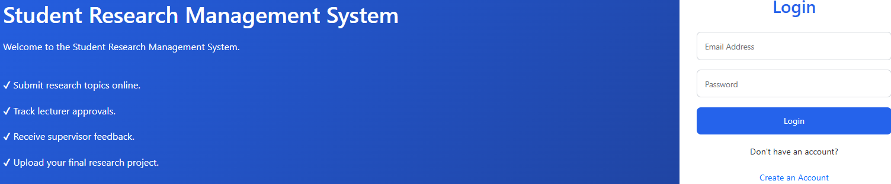
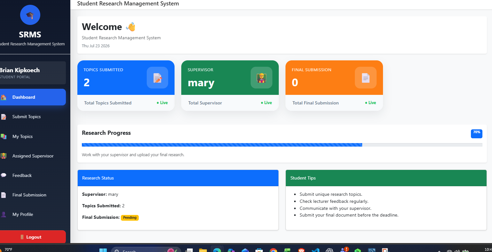
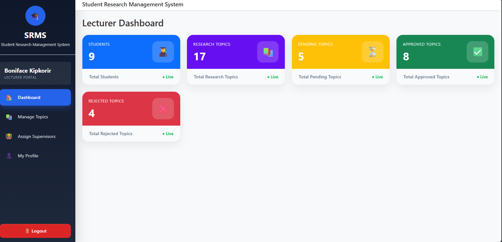
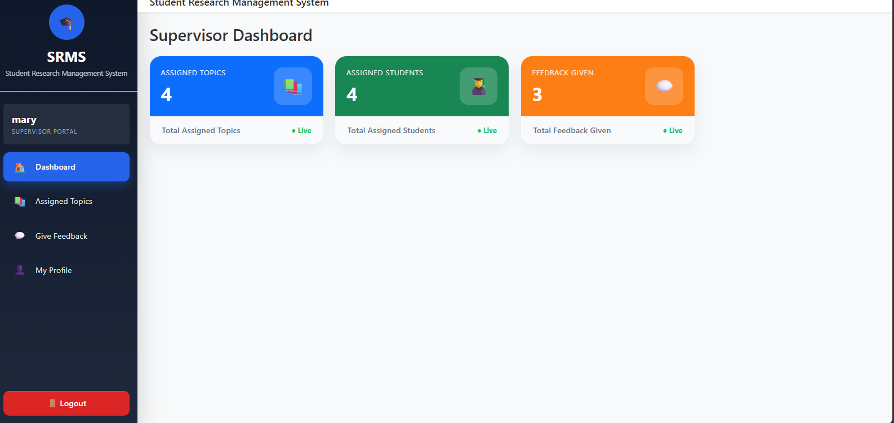
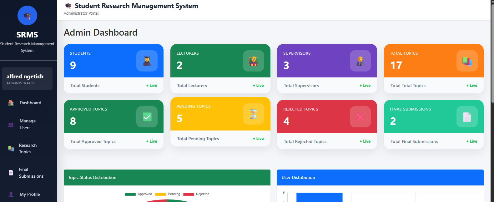

# Student Research Management System (SRMS)

The Student Research Management System (SRMS) is a web-based application designed to streamline the management of student research projects within a university. The system enables students to submit research topics, lecturers to review and approve them, supervisors to monitor research progress and provide feedback, and administrators to manage users and oversee the entire research process.

The project was developed using React for the frontend, Node.js and Express for the backend, and MySQL as the database.

## Features

- User authentication using JSON Web Tokens (JWT)
- Student registration and login
- Lecturer registration and login
- Supervisor registration and login
- Administrator dashboard
- Research topic submission (maximum of three topics per student)
- Topic review, approval, and rejection by lecturers
- Supervisor assignment after topic approval
- Supervisor feedback and progress monitoring
- Final research document submission
- User management by the administrator
- Dashboard statistics and analytics
- Responsive and modern user interface

## User Roles

### Student
- Register and log in to the system
- Submit up to three research topics
- View topic approval status
- Receive feedback from lecturers and supervisors
- Submit the final research document
- View assigned supervisor

### Lecturer
- Register and log in to the system
- Review submitted research topics
- Approve or reject research topics
- Provide comments and feedback
- Assign supervisors to approved topics

### Supervisor
- Register and log in to the system
- View assigned students
- Monitor research progress
- Provide guidance and feedback

### Administrator
- Manage all users
- View dashboard statistics
- Monitor research activities
- View final submissions
- Manage the entire system

## Technology Stack

### Frontend
- React.js
- React Router
- Axios
- Bootstrap 5
- HTML5
- CSS3
- JavaScript (ES6+)

### Backend
- Node.js
- Express.js
- JSON Web Token (JWT)
- Bcrypt.js
- Multer

### Database
- MySQL

### Development Tools
- Visual Studio Code
- Git
- GitHub
- Postman
- XAMPP

## System Architecture

The Student Research Management System (SRMS) follows a three-tier architecture consisting of the presentation layer, application layer, and data layer.

### Presentation Layer
The presentation layer is developed using React.js and provides user interfaces for students, lecturers, supervisors, and administrators. It allows users to interact with the system through a responsive and user-friendly web application.

### Application Layer
The application layer is built with Node.js and Express.js. It handles business logic, user authentication, authorization, topic management, supervisor assignment, feedback processing, and final document submissions. RESTful APIs are used to facilitate communication between the frontend and the backend.

### Data Layer
The data layer uses MySQL to securely store user accounts, research topics, supervisor assignments, feedback, and final submissions. The backend communicates with the database to retrieve and update information as required.

## Project Structure

```text
studentResearchSystem/
│
├── client/                    # React frontend
│   ├── public/
│   ├── src/
│   │   ├── components/
│   │   ├── pages/
│   │   ├── layouts/
│   │   ├── services/
│   │   ├── App.js
│   │   └── index.js
│   ├── package.json
│   └── README.md
│
├── server/                    # Node.js & Express backend
│   ├── config/
│   ├── controllers/
│   ├── middleware/
│   ├── routes/
│   ├── uploads/
│   ├── package.json
│   ├── server.js
│   └── README.md
│
├── database/
│   └── student_research_management.sql
│
├── .gitignore
└── README.md
```

## Installation and Setup

### 1. Clone the Repository

```bash
git clone https://github.com/Brian035tech/student_reseaarch_project.git
```

Replace `YOUR_GITHUB_USERNAME` with your actual GitHub username.

---

### 2. Navigate to the Project Folder


```bash
cd student_reseaarch_project
```

---

### 3. Install Backend Dependencies

```bash
cd server
npm install
```

---

### 4. Install Frontend Dependencies

Open a new terminal and run:

```bash
cd client
npm install
```

## Running the Application

### Start the Backend Server

Open a terminal and run:

```bash
cd server
npm start
```

The backend server will start on:

```text
http://localhost:5000
```

---

### Start the Frontend Application

Open another terminal and run:

```bash
cd client
npm start
```

The frontend application will be available at:

```text
http://localhost:3000
```

## Database Setup

Before running the application, ensure that MySQL is installed and running.

### 1. Create the Database

```sql
CREATE DATABASE student_research_management;
```

### 2. Import the Database

The SQL file is located in the `database` folder:

```text
database/student_research_management.sql
```

Import it using MySQL Workbench:

1. Open MySQL Workbench.
2. Connect to your MySQL server.
3. Open **Server → Data Import**.
4. Select **Import from Self-Contained File**.
5. Browse to `database/student_research_management.sql`.
6. Choose the `student_research_management` database.
7. Click **Start Import**.

After the import is complete, configure the `.env` file inside the `server` folder with your MySQL credentials and start the application.

## Screenshots

### Login Page



---

### Student Dashboard



---

### Lecturer Dashboard



---

### Supervisor Dashboard



---

### Admin Dashboard




## Future Enhancements

The following features can be added in future versions of the system:

- Email notifications for topic approval and feedback
- Real-time messaging between students and supervisors
- Plagiarism detection integration
- AI-assisted research topic recommendations
- Research progress tracking with milestones
- File version control for research documents
- Advanced reporting and analytics
- Mobile application support

## Author

**Kipkoech Brian**

- Software Engineering Student
- University of Eastern Africa, Baraton
- GitHub: https://github.com/Brian035tech

## License

This project is licensed under the MIT License.

Feel free to use, modify, and distribute this project for educational and research purposes.